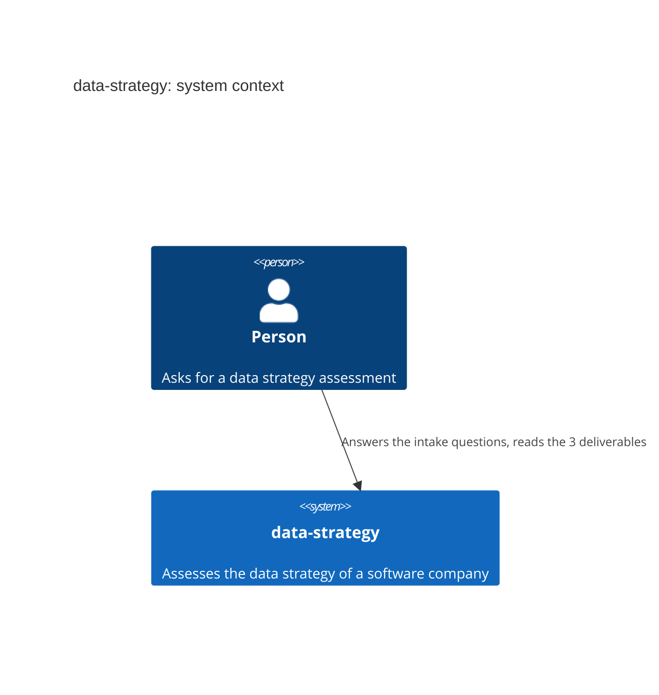
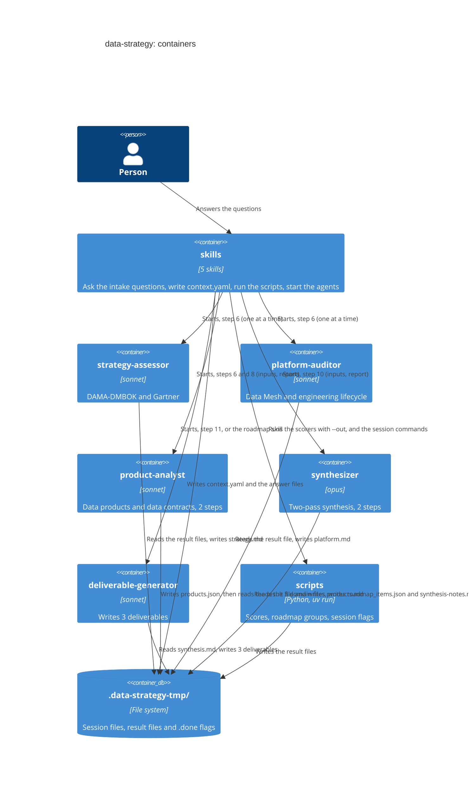

# data-strategy: C4 diagrams

## C4 level 1: system context

```mermaid
C4Context
  title data-strategy: system context
  Person(user, "Person", "Asks for a data strategy assessment")
  System(ds, "data-strategy", "Assesses the data strategy of a software company")
  Rel(user, ds, "Answers the intake questions, reads the 3 deliverables")
```

## C4 level 2: containers

```mermaid
C4Container
  title data-strategy: containers
  Person(user, "Person")
  Container(skill, "skills", "5 skills", "Ask the intake questions, write context.yaml, run the scripts, start the agents")
  Container(strat, "strategy-assessor", "sonnet", "DAMA-DMBOK and Gartner")
  Container(plat, "platform-auditor", "sonnet", "Data Mesh and engineering lifecycle")
  Container(prod, "product-analyst", "sonnet", "Data products and data contracts, 2 steps")
  Container(synth, "synthesizer", "opus", "Two-pass synthesis, 2 steps")
  Container(deliv, "deliverable-generator", "sonnet", "Writes 3 deliverables")
  Container(scripts, "scripts", "Python, uv run", "Scores, roadmap groups, session flags")
  ContainerDb(files, ".data-strategy-tmp/", "File system", "Session files, result files and .done flags")
  Rel(user, skill, "Answers the questions")
  Rel(skill, files, "Writes context.yaml and the answer files")
  Rel(skill, scripts, "Runs the scorers with --out, and the session commands")
  Rel(skill, strat, "Starts, step 6 (one at a time)")
  Rel(skill, plat, "Starts, step 6 (one at a time)")
  Rel(skill, prod, "Starts, steps 6 and 8 (inputs, report)")
  Rel(skill, synth, "Starts, step 10 (inputs, report)")
  Rel(skill, deliv, "Starts, step 11, or the roadmap skill")
  Rel(scripts, files, "Writes the result files")
  Rel(strat, files, "Reads the result files, writes strategy.md")
  Rel(plat, files, "Reads the result file, writes platform.md")
  Rel(prod, files, "Writes products.json, then reads the result file and writes products.md")
  Rel(synth, files, "Reads the 3 domain files, writes roadmap_items.json and synthesis-notes.md, then synthesis.md")
  Rel(deliv, files, "Reads synthesis.md, writes 3 deliverables")
```
